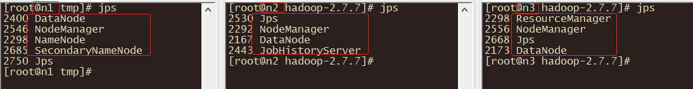

# 集群安装


## Purpose

本节描述如何搭建一个完全分布式的Hadoop集群，以3台服务器举例。可扩展到若干节点。本文档不涉及安全或高可用性等主题。

## Prerequisites

参考：搭建高可用集群时Linux环境必需配置的先决条件，先将Linux基础环境搭建成功。

## Installation

点击[下载]()相应版本，本文档采用2.7.7。安装Hadoop集群需要解压所软件在所有的节点上，所以将硬件的功能进行划分很重要。

<h2 id="cp">Component Planning</h2>

建议将NameNode和ResourceManager指定分开在两台节点上，这样即使某台节点挂了也不至于导致NameNode和ResoureManager同时挂掉。其余的节点则同时充当DataNode和NodeManager。

|        n1         |      n2       |             n3              |
| :---------------: | :-----------: | :-------------------------: |
| NameNode/DataNode |   DataNode    |          DataNode           |
|    NodeManager    |  NodeManager  | ResourceManager/NodeManager |
| SecondaryNameNode | HistoryServer |                             |

## Configure Hadoop

HDFS的守护程序是NameNode，SecondaryNameNode和DataNode。

YARN守护程序是ResourceManager，NodeManager和WebAppProxy。如果要使用MapReduce，则MapReduce作业历史服务器也将运行。对于大型安装，它们通常在单独的主机上运行。

所有配置文件都在路径：$HADOOP_HOME/etc/hadoop 中。

### 配置JAVA_HOME变量

在hadoop-env.sh、yarn-env.sh、mapred-env.sh中指定JAVA_HOME的路径。

### HDFS

配置hdfs文件系统的主机和端口，端口号在hadoop1.x版本默认使用的是9000，而在hadoop2.x中默认使用的是8020。

以及hadoop分布式集群经过格式化后数据保存的位置。

**core-site.xml**中配置：

```xml
<property>
	<name>fs.defaultFS</name>
	<value>hdfs://n1:8020</value>
</property>
<!-- haddop.tmp.dir默认值为/tmp。而/tmp中的不常用文件可能会被Linux删除。 -->
<property>
	<name>hadoop.tmp.dir</name>
	<value>/opt/cluster/hadoop-2.7.7/data/tmp</value>
</property>
```

在静态web页面上呈现内容时，以参数hadoop.http.staticuser.user指定的用户名作为筛选条件，默认dr.who。

**core-site.xml**中配置：

```xml
<property>
	<name>hadoop.http.staticuser.user</name>
	<value>renwujie</value>
</property>
```

测试环境可以关闭hdfs中文件访问权限，默认为true。

**hdfs-site.xml**中配置：

```xml
<property>
	<name>dfs.permissions.enabled</name>
	<value>false</value>
</property>
```

### YARN

配置ResourceManager的主机名；以及web访问地址。

**yarn-site.xml**中配置：

```xml
<property>
	<name>yarn.resourcemanager.hostname</name>
	<value>n3</value>
</property>
<!-- RM Web UI的默认值就是8088 -->
<property>
    <name>yarn.resourcemanager.webapp.address</name>
    <value>${yarn.resourcemanager.hostname}:8088</value>
</property>
```

配置执行MapReduce job的框架。可选值：local，classic，yarn。

**mapred-site.xml** 中配置：

```xml
<property>
    <name>mapreduce.framework.name</name>
    <value>yarn</value>
</property>
```

如果在mapred-site.xml中设置了mapreduce.framework.name为yarn的话，就需要配置yarn.nodemanager.aux-services参数了。该参数用于指定执行MapReduce job时，yarn使用的shuffle（混淆）技术。如果使用的话值为mapreduce_shuffle。

**yarn-site.xml**中配置：

```xml
 <property>
     <name>yarn.nodemanager.aux-services</name>
     <value></value>
     <!--<value>mapreduce_shuffle</value>-->
     <description>A comma separated list of services where service name should only
      contain a-zA-Z0-9_ and can not start with numbers</description>
 </property>
```

### SecondaryNameNode

**hdfs-site.xml**中配置：

```xml
<property>
	<name>dfs.namenode.secondary.http-address</name>
	<value>n1:50090</value>
</property>
```

### HistoryServer

**mapred-site.xml**中配置：

```xml
<property>
    <name>mapreduce.jobhistory.address</name>
    <value>n2:10020</value>
</property>
<property>
    <name>mapreduce.jobhistory.webapp.address</name>
    <value>n2:19888</value>
</property>
```

### 日志聚合

**yarn-site.xml**中配置：

```xml
<property>
	<name>yarn.log-aggregation-enable</name>
	<value>true</value>
</property>
<!-- 聚合日志保留时间 -->
<property>
	<name>yarn.log-aggregation.retain-seconds</name>
	<value>106800</value>
</property>
```

### Slaves文件

slaves文件用于指定DataNode和NodeManager所在节点，每行一个。

```
n1
n2
n3
```

## Operating the Hadoop Cluster

完成以上配置后，将整个$HADOOP_HOME文件分发到集群中的所有节点上。分发前删除掉：$HADOOP_HOME/share/doc目录。因为该目录只是一些参考文档，且很大。分发时将占用大量带宽，浪费时间。

```shell
scp -r $HADOOP_HOME root@n2.com.rwj:/opt/
scp -r $HADOOP_HOME root@n3.com.rwj:/opt/
```

### 格式化集群

要启动hadoop集群，需要将HDFS和YARN都启动。

首次启动HDFS时，需要将其格式化。在NameNode机器所在节点上执行：

```shell
$ HADOOP_HOME/bin/hdfs namenode -format 
```

### 启动/关闭集群

以下所有命令是启动命令，如果是关闭，将start替换为stop即可。启动时一边启动一边用命令jps查看相应进程是否启动成功。

> **[info]注意**
>
> 以下命令单独启动某进程时，必需要在相应的节点上进行该命令的操作。

启动HDFS：

```shell
# 使用
$HADOOP_HOME/sbin/hadoop-daemon.sh start namenode
$HADOOP_HOME/sbin/ hadoop-daemon.sh start datanode
# 或者
$HADOOP_HOME/sbin/start-dfs.sh
```

启动YARN：

```shell
# 使用
$HADOOP_HOME/sbin/yarn-daemon.sh start resourcemanager
$HADOOP_HOME/sbin/yarn-daemon.sh start nodemanager
# 或者
$HADOOP_HOME/sbin/start-yarn.sh
```

启动SecondaryNamenode

```shell
$HADOOP_HOME/sbin hadoop-daemon.sh start secondarynamenode
```

启动HistoryServer

```shell
$HADOOP_HOME/bin/mapred --daemon start historyserver
#或者
$HADOOP_HOME/sbin/mr-jobhistory-daemon.sh start historyserver
```

最终，对应于开始的组件规划（[Component Planning](#cp)）；每台节点上都应该看到相应的进程启动并稳定运行。



## Web Interface

成功启动集群后即可查看对应组件的Web UI是否可以正常访问。

| Daemon               | Web Interface    | Notes     |
| -------------------- | ---------------- | --------- |
| NameNode             | https://n1:50070 | 默认50070 |
| ResourceManager      | https://n3:8088  | 默认8088  |
| MapReduce JobHistory | https://n2:19888 | 默认19888 |


