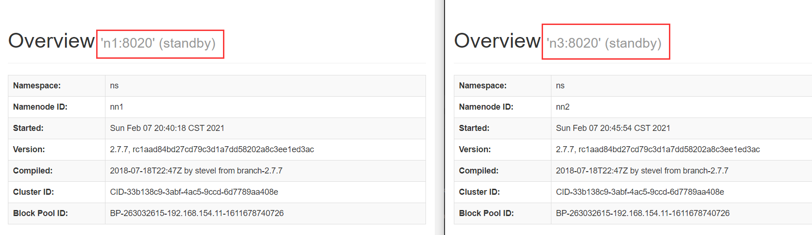
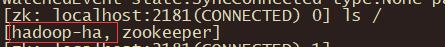
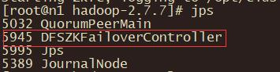
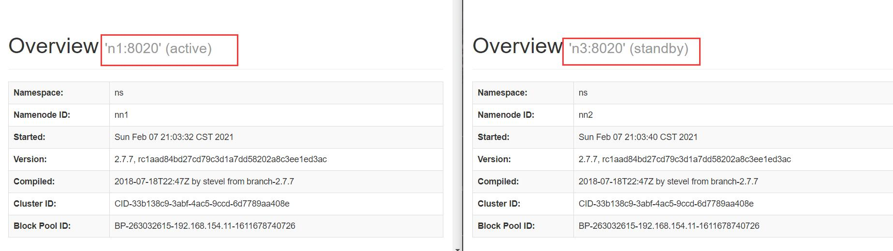

# 部署Hadoop HA集群

## Purpose

本节描述如何搭建一个高可用的完全分布式Hadoop集群，以3台服务器举例。

## Prerequisites

1. 已经搭建好了一个完全分布式的Hadoop集群。参考[上节](./01-cluster-setup.md)。
2. 在以上Hadoop的所有节点上安装Zookeeper，配置一个完全分布式的Zookeeper集群。可参考：~~~

## Component Planning

在[上节](./01-cluster-setup.md)的基础上搭建HA Hadoop集群，相当于增加一个有NameNode。这时要用到Zookeeper。机器规划更新如下（加粗的是增加的的）：

|        n1         |      n2       |             n3              |
| :---------------: | :-----------: | :-------------------------: |
| NameNode/DataNode |   DataNode    |    **NameNode**/DataNode    |
|    NodeManager    |  NodeManager  | ResourceManager/NodeManager |
| SecondaryNameNode | HistoryServer |                             |
|   **Zookeeper**   | **Zookeeper** |        **Zookeeper**        |

## Configure HA Hadoop Cluster

主要修改hdfs-site.xml和core-site.xml两个文件。

如果是刚搭建好的Hadoop分布式集群，还没有运行，可以直接进行HA的配置。如果是已经运行了的集群，建议备份配置文件。

搭建前请关闭所有Hadoop进程和Zookeeper进程。

### 修改配置文件

#### hdfs-site.xml

删除SecondaryNameNode的配置——或者一开始配置Hadoop集群是不配置也可以。

给NameNode管理的元数据一个逻辑名称:

```xml
<property>
    <name>dfs.nameservices</name>
    <value>ns</value>
</property>
```

指定两个NameNode的逻辑名称：

```xml
<property>
	<name>dfs.ha.namenodes.ns</name>
	<value>nn1,nn2</value>
</property>
```

指定两个NameNode实例的RPC内部通信地址：

```xml
<property>
    <name>dfs.namenode.rpc-address.ns.nn1</name>
	<value>n1:8020</value>
</property>
<property>
	<name>dfs.namenode.rpc-address.ns.nn2</name>
	<value>n3:8020</value>
</property>
```

指定两个NameNode实例的Http地址：

```xml
<property>
    <name>dfs.namenode.http-address.ns.nn1</name>
    <value>n1:50070</value>
</property>
<property>
    <name>dfs.namenode.http-address.ns.nn2</name>
    <value>n3:50070</value>
</property>
```

指定JournalNode日志节点的URI：

```xml
<property>
    <name>dfs.namenode.shared.edits.dir</name>
    <value>qjournal://n1:8485;n2:8485;n3:8485/ns</value>
</property>
```

指定NournalNode本地存储日志的路径：

```xml
<property>
    <name>dfs.journalnode.edits.dir</name>
    <value>/opt/cluster/hadoop-2.7.7/data/jn</value>
</property>
```

指定代理访问方式：

```xml
<property>
    <name>dfs.client.failover.proxy.provider.mycluster</name>
    <value>org.apache.hadoop.hdfs.server.namenode.ha.ConfiguredFailoverProxyProvider</value>
</property>
```

指定隔离方案：

```xml
<property>
    <name>dfs.ha.fencing.methods</name>
    <value>sshfence</value>
</property>
<property>
    <name>dfs.ha.fencing.ssh.private-key-files</name>
    <value>/home/root/.ssh/id_rsa</value>
</property>
```

开启自动故障转移：

```xml
<property>
    <name>dfs.ha.automatic-failover.enabled</name>
    <value>true</value>
 </property>
```

#### core-site.xml

指定Zookeeper的实例和端口号：

```xml
<property>
    <name>ha.zookeeper.quorum</name>
    <value>n1:2181,n2:2181,n3:2181</value>
 </property>
```

指定（修改）命名空间：

```xml
<property>
    <name>fs.defaultFS</name>
	<value>hdfs://ns</value>
</property>
```

### 分发配置文件

如果是一个新的集群，将配置好的Hadoop文件发送到所有节点上。如果是一个已经使用了的集群，只要发送配置文件即可。

## 同步NameNode节点元数据 & 启动HA Hadoop集群

同步NameNode节点的元数据要严格按照以下顺序操作。

1. 启动所有节点的Zookeeper；

   ```shell
   zkServer.sh start
   ```

2. 启动所有的JournalNode；

   ```shell
   $HADOOP_HOME/sbin/hadoop-daemon.sh start journalnode
   ```

3. 同步元数据；

   - 如果是一个新集群：格式化（只需要格式化一台NameNode即可）。否则不需要格式化。

   - 如果不是一个新集群，就直接在旧的NamoNode节点上，初始化JournalNode（注意初始化JournalNode前要先启动所有的JournalNode）。初始化命令如下：

     ```shell
     $HADOOP_HOME/bin/hdfs namenode -initializeSharedEdits
     ```

   - 之后，启动NameNode。

   - 然后到另一台NameNode节点上同步JournalNode。同步命令如下：

     ```shell
     $HADOOP_HOME/bin/hdfs namenode -bootstrapStandby
     ```
     
   - 这时候如果把第二台NameNode也启动，那么在WebUI就能看到两个NameNode节点都处于StandBy的状态。

     

4. 元数据同步完成后，先关闭所有NameNode进程。然后在任意NameNode所在节点上初始化ZKFC。命令如下：

   ```shell
   $HADOOP_HOME/bin/hdfs zkfc -formatZK
   ```

   初始化ZKFC完成后，进入zk客户端，检查是否生成了名为hadoop-ha的节点目录：

   ```shell
   zkCli.sh start
   ls /
   ```

   

5. 在两台NameNode所在的节点上分别启动zkfc监听器：

   ```shell
   $HADOOP_HOME/sbin/hadoop-daemon.sh start zkfc
   ```

   进程对应的名称为：DFSZKFailoverController。可用jps查看是否启动成功。

   

   

6. 启动HDFS和YARN服务。

   这时在启动两个NameNode后就会发现一个NameNode状态为active，另一个为standby。

   

初次启动HA需要按照以上步骤同步元数据。后续启动HA集群，集群就会自动进行元数据同步监听和故障容错，只要按顺序启动相应组件即可。

## 补充

后续重新启动集群时也严格按照：ZK -> JournalNode -> ZKFC -> HDFS -> YARN 的顺序启动。

关闭顺序建议：YARN -> HDFS -> ZKFC -> JournalNode -> ZK。

如果手动启动麻烦，只需要调整start-dfs.sh中NameNodes、DataNodes、JournalNode和ZKFC启动的顺序即可调用start-dfs.sh和start-yarn.sh启动。更进一步，可以自己写一个shell脚本，一个脚本按顺序启动、关闭所有进程。